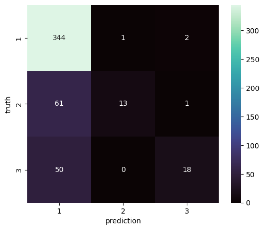

[README.md](https://github.com/user-attachments/files/32456333/README_md.md)
# Sentiment Analysis of Digikala Comments

## Project Overview

This project is a **Sentiment Analysis** model that receives user comments and classifies them into three categories:

- **1: Satisfied**
- **2: Neutral / Average**
- **3: Dissatisfied**

The main goal is to build a machine-learning model that can identify the level of satisfaction or dissatisfaction expressed in a user comment.

---

## Project Goal

The purpose of this project is to build a machine-learning model for automatic classification of user reviews. The dataset consists of **Digikala product comments** obtained from a dataset available on **Kaggle**.

The model learns patterns from the training comments and then predicts whether a new comment belongs to the satisfied, average, or dissatisfied category.

---

## Dataset

The data was divided into training and test sets:

| Set | Number of Samples |
|---|---:|
| Train | 2,282 |
| Test | 490 |
| Total | 2,772 |

The training set was used to train the model, while the test set was used to evaluate its performance.

The data contains user comments from Digikala, and the original dataset was obtained from Kaggle.

---

## Model Training Process

The general training process was:

1. Collecting and preprocessing the text data
2. Splitting the data into training and test sets
3. Converting raw text into features that can be used by a machine-learning algorithm
4. Training the model using the training data
5. Predicting labels for the test comments
6. Calculating evaluation metrics
7. Examining the Confusion Matrix
8. Experimenting with model settings and evaluation-related parameters to improve the final result

After the initial training, different settings and metrics were examined to obtain a better final performance.

---

## How to Use the Model

To use the model, a text comment is provided as input. The model processes the comment and returns one of the following categories:

```text
1 → Satisfied
2 → Average
3 → Dissatisfied
```

For example, a positive comment about product quality can be classified as **Satisfied**.

---

## Model Evaluation

The model was evaluated on **490 test samples**.

Final results:

| Class | Precision | Recall | F1-score | Support |
|---|---:|---:|---:|---:|
| 1 | 0.76 | 0.99 | 0.86 | 347 |
| 2 | 0.93 | 0.17 | 0.29 | 75 |
| 3 | 0.86 | 0.26 | 0.40 | 68 |
| **Accuracy** | **0.77** | | | **490** |
| **Macro Avg** | **0.85** | **0.48** | **0.52** | **490** |
| **Weighted Avg** | **0.80** | **0.77** | **0.71** | **490** |

### Evaluation Metrics

- **Precision:** The proportion of predictions for a class that were actually correct.
- **Recall:** The proportion of actual samples of a class that were correctly identified.
- **F1-score:** A balanced measure combining Precision and Recall.
- **Support:** The number of actual samples belonging to each class in the test set.
- **Accuracy:** The proportion of all test samples that were classified correctly.

---

## Results Analysis

The model achieved an overall **Accuracy of 0.77**, meaning that approximately 77% of the test samples were classified correctly.

The model performed particularly well on **Class 1 (Satisfied)**. Its Recall is **0.99**, meaning that almost all actual samples belonging to this class were successfully identified.

The Recall values for **Class 2 (Average)** and **Class 3 (Dissatisfied)** are lower. This indicates that distinguishing average and dissatisfied comments is more challenging for the current model.

The test set is also imbalanced: Class 1 contains **347 samples**, while Class 2 and Class 3 contain only **75 and 68 samples**, respectively. This class imbalance can affect the model's performance on the less frequent classes.

---

## Confusion Matrix

A **Confusion Matrix** was used to examine the model's classification performance across the three classes.

The Confusion Matrix shows how actual samples from each category were classified by the model and helps identify the types of classification errors.


> 

---

## Model Improvement and Tuning

After the initial training, experiments were performed with different metrics and model settings in order to obtain the best possible result.

The model was evaluated using:

- Precision
- Recall
- F1-score
- Accuracy

The selected final result achieved an overall **Accuracy of 77%**.

---

## Project Strengths

- Automatic classification of Persian user comments
- Use of real-world user reviews
- Three-level sentiment classification
- Separate test set for evaluation
- Evaluation using multiple performance metrics
- Use of a Confusion Matrix for error analysis

## Project Limitations

- The number of samples is not balanced across all classes.
- Classifying average and dissatisfied comments is more difficult than classifying satisfied comments.
- Accuracy alone does not fully describe the model's performance across all classes, so Precision, Recall, and F1-score were also considered.

---

## Suggested Project Structure

```text
project/
│
├── main.ipynb
├── README.md
├── confusion_matrix.png
└── dataset/
    ├── train
    └── test
```

File and folder names can be changed according to the actual project structure.

---

## Conclusion

This project developed and evaluated a sentiment-analysis model for classifying Digikala comments into three categories: **Satisfied, Average, and Dissatisfied**.

The model was trained on **2,282 training samples** and evaluated on **490 test samples**. The final evaluation resulted in an overall **Accuracy of 0.77**.

The results show that the model performs very well at identifying satisfied comments, while there is still room for improvement in recognizing average and dissatisfied comments. Using a larger and more balanced dataset, along with further experiments in text preprocessing and model tuning, could improve the performance of the system.

---

## Technologies and Concepts

- Python
- Machine Learning
- Natural Language Processing (NLP)
- Sentiment Analysis
- Text Classification
- Precision
- Recall
- F1-score
- Accuracy
- Confusion Matrix
- Jupyter Notebook
- Kaggle Dataset

---

## Project Status

**Project Status: Completed**

The model has been trained, evaluated on a separate test set, and analyzed using multiple performance metrics.
